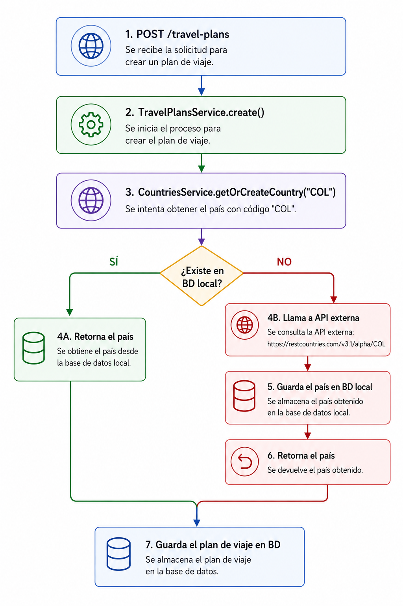
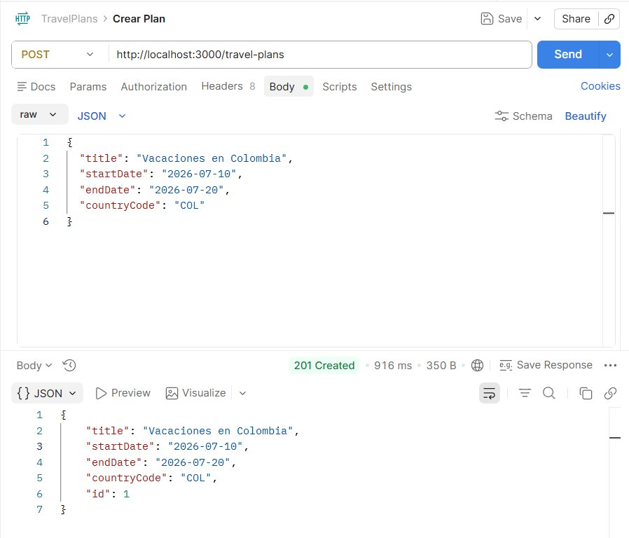
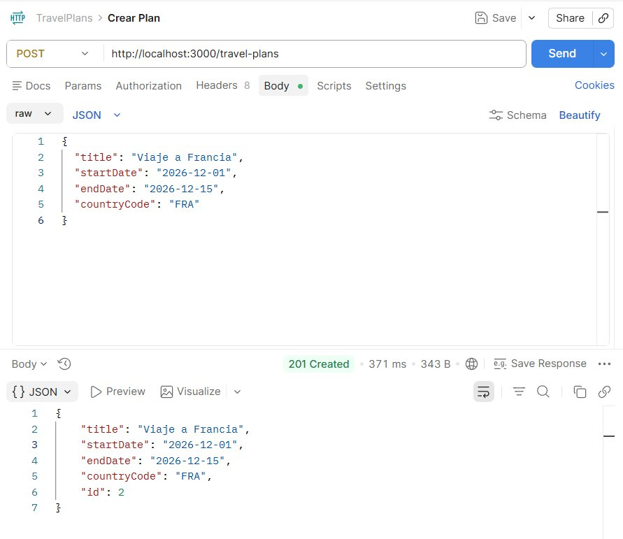
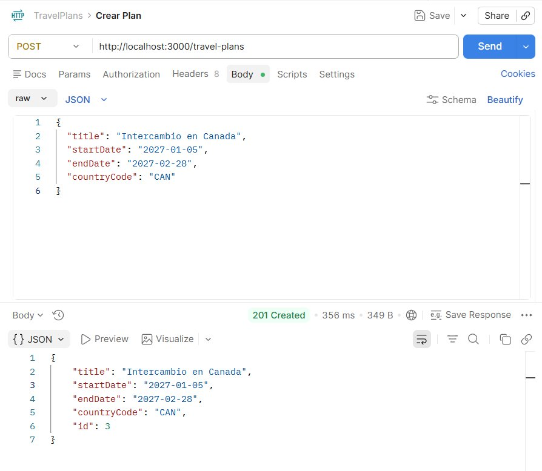
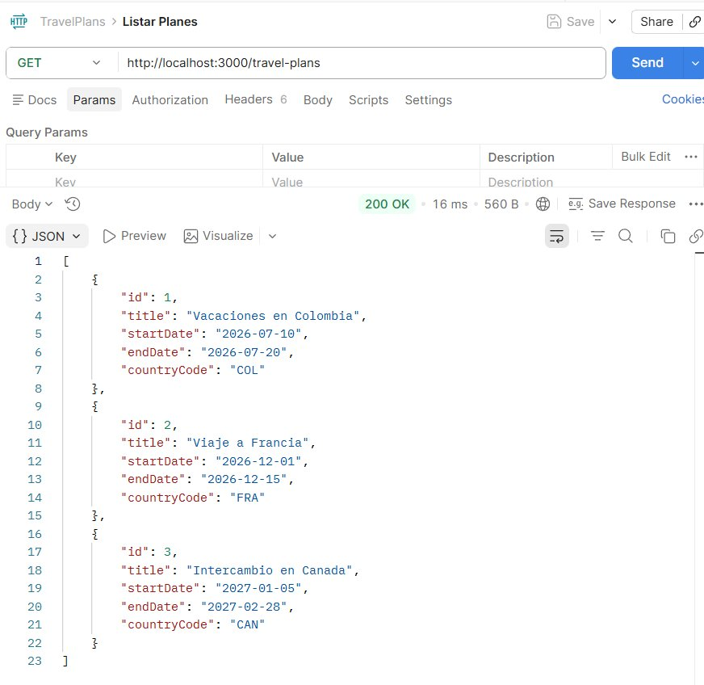
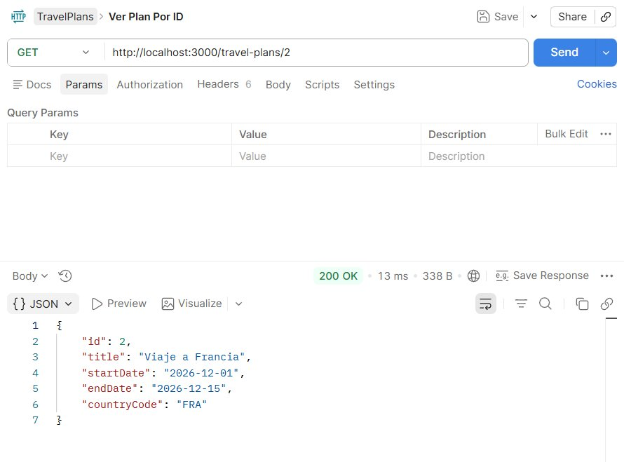
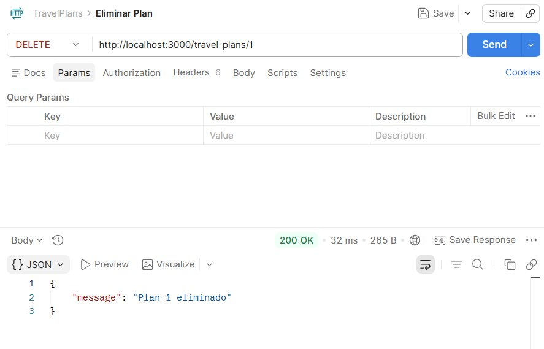
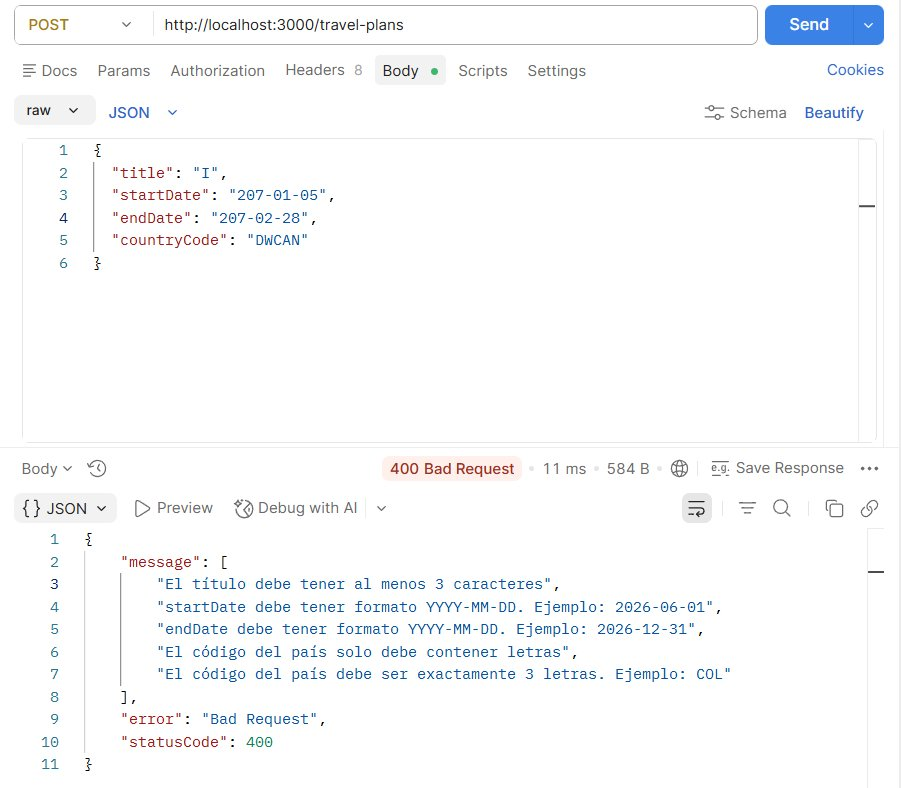

# Travel Parcial Joel Niño


### Pasos para ejectuar

**1. Clonar el repositorio**

```text
git clone <url>
cd preparcial2-joel
```

**2. Instalar dependencias**

```text
npm install
```

**3. Ejecutar**

```text
npm run start:dev
```


---

## Arquitectura interna

El proyecto está dividido en dos módulos principales.

CountriesModule es un módulo de uso interno. No expone ningún endpoint HTTP.
Su única responsabilidad es obtener la información de un país, primero buscando en la
base de datos local y si no lo encuentra, consultando la API externa de RestCountries
y guardando el resultado. Contiene la entidad Country, el servicio de caché y el
provider que encapsula la llamada a la API externa.

TravelPlansModule es el módulo público y el único que expone endpoints HTTP.
Cuando se crea un plan de viaje, antes de guardarlo consulta al CountriesModule
para verificar que el país existe, ya sea en la base de datos local o en la API externa.

La comunicación entre módulos se hace a través de inyección de dependencias.
TravelPlansModule importa CountriesModule y usa su servicio internamente,
sin exponer ninguna funcionalidad de países hacia afuera.


### Flujo de caché de países

Cuando se crea un plan de viaje, se valida el código Alpha-3 del país de la siguiente manera:




El CountriesModule no expone ningún endpoint HTTP. Solo exporta CountriesService para el uso interno de otros módulos.

---

## Ejemplos de peticiones en Postman

### **POST /travel-plans — Crear un plan de viaje a Colombia**

```json
{
  "title": "Vacaciones en Colombia",
  "startDate": "2026-07-10",
  "endDate": "2026-07-20",
  "countryCode": "COL"
}
```



---

### **POST /travel-plans — Crear un plan de viaje a Francia**

```json
{
  "title": "Viaje a Francia",
  "startDate": "2026-12-01",
  "endDate": "2026-12-15",
  "countryCode": "FRA"
}
```



---

### **POST /travel-plans — Crear un plan de viaje a Canada**

```json
{
  "title": "Intercambio en Canada",
  "startDate": "2027-01-05",
  "endDate": "2027-02-28",
  "countryCode": "CAN"
}
```



---

### **GET /travel-plans — Listar todos los planes**

```
GET http://localhost:3000/travel-plans
```



---

### **GET /travel-plans/:id — Ver un plan especifico**

```
GET http://localhost:3000/travel-plans/2
```



---

### **DELETE /travel-plans/:id — Eliminar un plan**

```
DELETE http://localhost:3000/travel-plans/1
```



---

### **POST /travel-plans — Ejemplo de validacion con datos incorrectos**

```json
{
  "title": "I",
  "startDate": "207-01-05",
  "endDate": "207-02-28",
  "countryCode": "DWCAN"
}
```



---

## Limpiar la base de datos

Para limpiar la base de datos se debe eliminar el archivo donde se guarda todo:

```bash
del database.sqlite
```

# Cambios Parcial & Explicación Base De Datos

**Base De Datos**

Para la persistencia de los datos se usó SQLite y TypeORM. Al agregar un gasto a un plan, este no se 
guarda en una tabla separada sino que se queda almacedano dentro del registro del plan. Acá
se usa simple-json TypeORM, ya que esto nos permite convertir el arreglo de gastos en un JSON y se almacena en una sola columna, así, cada vez que agreguemos un nuevo gasto, se toma ese arreglo y se añade el objeto, de modo que queda actualizado y no sobreescribe los gastos que ya se hayan guardado. 
En resumen, cuando se llama al END-POINT encargado de agregar el gasto, primero se busca el plan con su ID en la base de datos, luego se toma el arreglo de expenses de ese plan y se agrega el gasto como se explicó anteriormente y finalmente se guarda todo.

## Cambios realizados con respecto al preparcial

Se creo un módulo de usuarios con su entidad, servicio y controlador. Ahora cada plan de viaje tiene que estar vinculado a un usuario existente, cosa que antes no existía ni siquiera. También, al crear un plan se verifica que el usuario exista en la base de datos y si no existe tira error 404. En travel.entity.ts agreamos userID y el arreglo de Expenses. Y en travel-plans-service modificamos el metodo de create para que se busque el ID del usuario primero.

Se agregó la funcionalidad de añadir gastos a un plan de viaje existente. Cada gasto tiene una descripción, un monto y una categoría (Creamos un nuevo dto llamado create-expense.dto.ts), estos tienen verificaciones como que no pueden ser vacios o que el monto debe ser positivo. Los gastos se guardan dentro del mismo registro del plan sin usar tablas adicionales. En travel-plans.controller agregamos el respectivo END-POINT que llama a addExpense del servicio de travel-plans para realizar lo anterior. 

Y lo último que se hizo fue crear un middleware llamado RegistroMiddleware que intercepta las peticiones a los módulos de viajes y usuarios. Lo que hace esto es que por cada petición imprime en la consola el identificador del usuario tomado del header x-user-id ,la ruta a la que accedió y el método HTTP usado. Si el header no existe se muestra ANONYMOUS.

